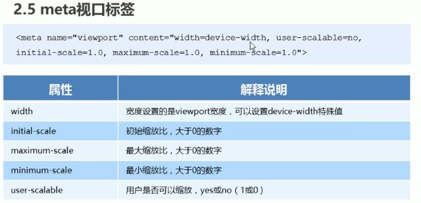

##移动端基础
---
###视口
- 布局视口
  - 一般默认980px（不适合布局）
- 视觉视口
  - 用户正在看到的网站区域
- 理想视口
  - 为了使网站在移动端有最理想的浏览和阅读宽度而定
  - 理想视口，对设备来讲，是最理想的视口尺寸
  - 需要手动添写meta视口标签通知浏览器操作
  - meta视口标签的主要目的：布局视口的宽度应该与理想视口的宽度一致，简单理解就是设备有多宽，我们布局的视口就多宽
####mata视口标签

---
###二倍图
####物理像素&物理像素比
- 物理像素点指的是屏幕显示的最小颗粒，是物理真实存在的。
- 开发时的1px不一定等于1个物理像素的
- PC端页面，1个px等于一个物理像素，但移动端不一定
一个px的能显示的物理像素点的个数，称为物理像素比或屏幕的像素比
- Retina（视网膜屏），更多物理像素点压缩到一块屏幕
####倍图
- 50\*50在手机会被拉成100\*100
- 采取二倍图，找一个100\*100图片，然后手动缩小成50\*50
####背景缩放background-size
> background-size:宽度 高度;
> //cover 把背景图片扩展至足够大，以使背景图像和高度完全适应内容区域
> //contain 将图片扩展至最大尺寸（正好）
---
###移动端开发选择
####单独移动端
####响应式
---
###移动端技术解决方案
移动端浏览器内核以webkit为主
####CSS初始化normalize.css
(http://necolas.github.io/normalize.css/)
####css3盒子模型box-sizing
####移动端特殊样式
> a{-webkit-tap-highlight-color:transparent;}
> input{-webkit-appeaance:none;}
> img,a{-webkiy-touch-callout:none;}//禁用长按菜单
---
###移动端常见布局
####1.单独制作移动端页面（主流）
- 流式布局（百分比布局）
- flex 弹性布局
- less+rem+媒体查询布局
- 混合布局
####2.响应式页面兼容移动端
- 媒体查询
- bootstrap
---
