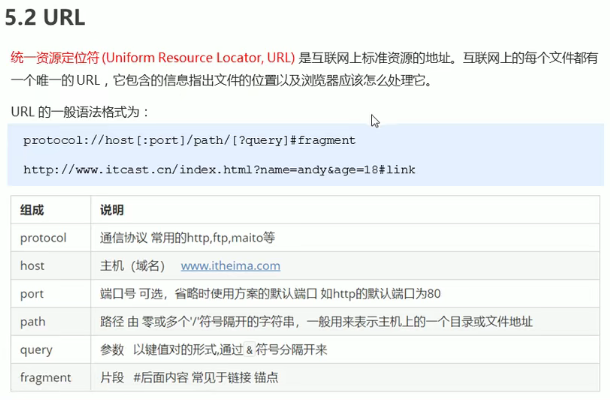
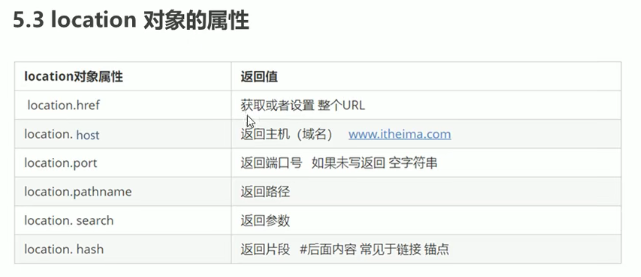
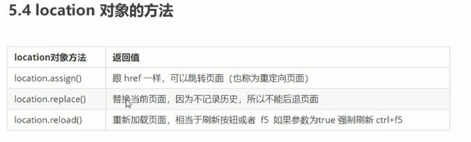
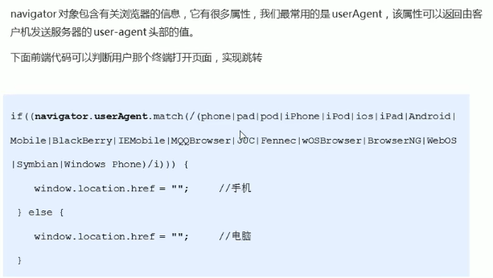
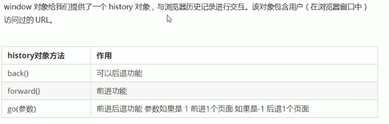
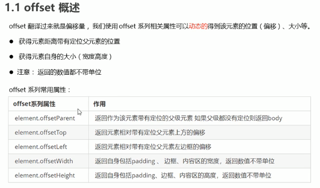

#JS
---
###同步与异步
> console.log(1);
> setTimeout(function(){
>  console.log(3);  
> })
> console.log(2);

回调函数被放进异步队列，先把执行栈中的同步任务执行完，再去执行异步任务
- 由于主线程不断的重复获取任务、执行任再获取任务、再执行，所以这种机制被称为事件循环(event loop)

###location对象

- href和search

###navigator对象

###history对象

###offset
