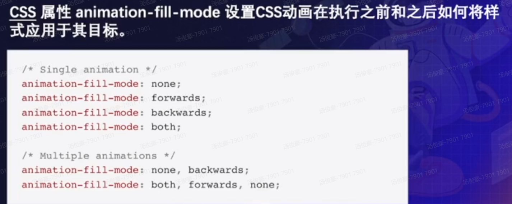

#1.动画的基本原理
动画是什么，动画发展史，计算机动画原理

---
###动画的基本原理
####什么是动画
动画是通过快速连续排列彼此差异极小的连续图像来制造运动错觉和变化错觉的过程。--维基百科

####动画历史
- 常见前端动画技术
  - Sprite动画
  - CSS动画
  - JS动画
  - SVG动画
  - WebGL动画
- 按应用分类
  - UI动画
  - 基于Web的游戏动画
  - 动画数据可视化

####计算机动画的原理

#2.前端动画分类
CSS，SVG,JS动画对比，如何做选择。

---
###CSS

###SVG
svg是基于XML的适量图形描述语言，它可以与CSS和JS较好的匹配，实现SVG动画通常有三种方式:SMIL、JS、CSS

SVG经常使用animation,transfor，transition来实现动画，它比JS更加简单方便

###JS动画

###如何选择

- 当为UI元素采用较小的独立状态时，使用CSS
- 在需要对动画进行大量控制时，使用JS
- 在特定的场景下可以使用SVG，可以使用CSS或JS去操作SVG变化

#3.实现前端动画
手动实现一个前端JS动画库

---
#4.相关实践
相关开发资源，工作实践，开发技巧，调试技巧

---

动画代码示例:
codepen.com
codesandbox.com

设计网站:
dribbble.com

动画制作工具(一般都是UE、UI同学使用):
2D:Animate CC、After Effects
3D:Cinema 4D、Blender、Autodesk Maya

