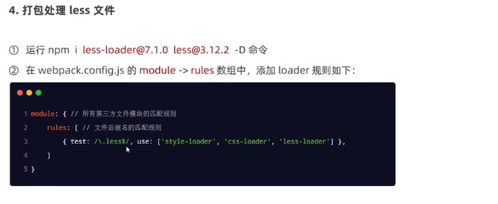

#前端工程化

##webpack

3.在项目中安装webpack
安装webpack相关的两个包
> npm install webpack@5.5.1 webpack-cil@4.7.2 -D
> npm install webpack webpack-cli --save-dev

###webpack中的插件

- 安装webpack-dev-server
> npm install webpack-dev-server@3.11.0 -D
> script src="/bundle.js" script

- dist删除不影响实时打包

> npm install -D @babel/core

