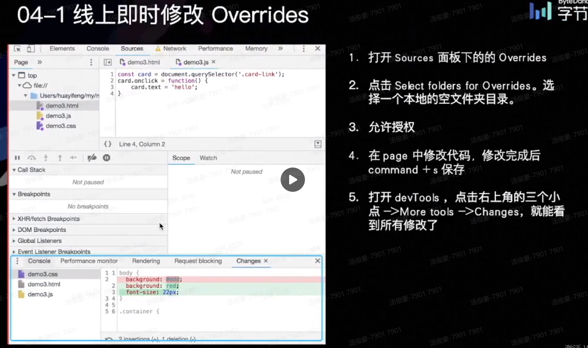

#调试知识
---
##Chrome DevTools
###.cls
动态添加修改删除类名

###.hov
勾选强制显示状态

###Computed
点击其里面的样式箭头会跳转到styles面板中的css规则

###右键capture node截图
截取节点截图

console.log
console.warm
console. info
console.error

> console.log('%s %o,%c%s','hello',{name:'tjh',age:21},'font-size: 24px;color: red;','welcome')
> console.table(); //具象化JSON信息
> console.dir(body); 打印节点

###Source debugger
> debugger;

watch可添加监听变量

##代码压缩

用于监控，上线时会删除sourcemap

##Performance
渲染花费的时间，定位性能问题

##Network
各种请求,fetch/xhr
###no throatting
模拟网络情况

##application
本地存储相关

#移动端调试
###真机调试

###代理工具调试

#调试技巧

